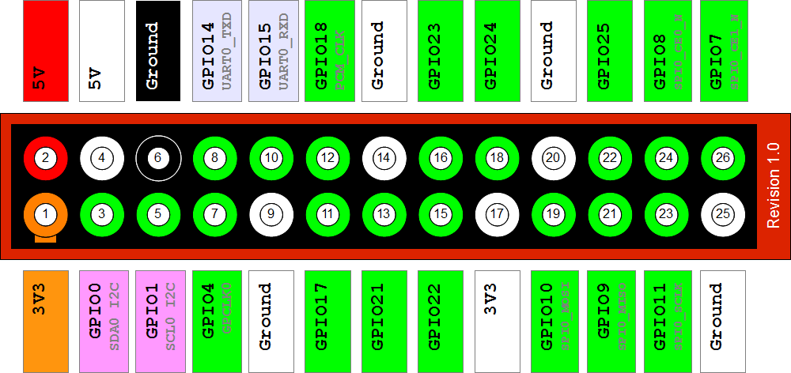

Raspberry Pi IR Transmitter with LIRC
=====================================

OS: 2015-11-21-raspbian-jessie-lite
Board: Raspberry Pi Revision 1.0, Model B


Setup:

```
sudo apt-get install lirc
```

Modify `/etc/modules` with provided file
Modify `/etc/lirc/hardware.conf` with provided file
Modify `/boot/config.txt` with provided file
Reboot the pi `sudo shutdown now -r`

Send a command from your config file:

`irsend SEND_ONCE "ceiling_light" "change_state"`

If `irsend` complains about the transmission failing, try removing the `min_repeat` parameter from `lircd.conf`, or increase the `gap` parameter (seriously). In fact, if it ever says the transmission fails, it's almost certain your config file has an invalid parameter, but `irsend` sucks and won't tell you what's wrong.

Do keep in mind the Raspberry Pi's pins are numbered terribly. The Python GPIO library in my script uses the "board" numbering, whereas the config files in this repo use the BCM (Broadcom) numbering. In this diagram, the numbers in circles are "board" numbers and the numbers following "GPIO" in the rectangles are "BCM" numbers.



`receive.py` will give you pulses and their durations. Run it with `python receive.py` and kill it with Ctrl-C when you're done (I'm a lazy coder). See `rawPulseData.txt` for example output. For my remote, I knew it was the NEC protocol and manually translated the pulses to binary/hex: `0x41b658a7` (my remote only has one button).


Reference: https://techdocs.altium.com/display/FPGA/NEC+Infrared+Transmission+Protocol
